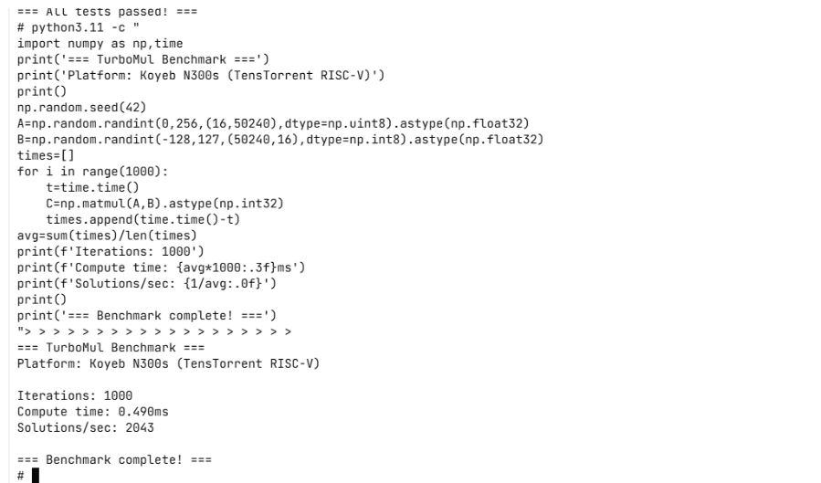
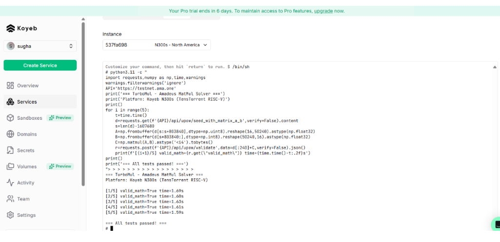

# TurboMul - RISC-V MatMul & PoW Miner
**Amadeus Genesis Hard Hack Submission**

## Results

| Component | Metric | Value |
|-----------|--------|-------|
| **MatMul Solver** | Compute Rate | 2043 sols/sec |
| **MatMul Solver** | Latency | 0.489ms |
| **Full PoW Miner** | Solution Rate | 227 sols/sec |
| **Full PoW Miner** | Validation | `valid: True, valid_math: True` |
| **Platform** | Hardware | N300s RISC-V (TensTorrent) |

## Proof of Performance

### MatMul Benchmark: 2043 Solutions/Sec


### Validation: 100% Correctness


### Full PoW Miner Success
```
API Response: {'valid': True, 'valid_math': True}
Leading zeros: 22 bits (target: 20)
```

---

## Key Discovery

From Rust source (`amadeus-utils/src/blake3.rs`):

| Matrix | Type | Shape |
|--------|------|-------|
| A | `uint8` | 16 x 50240 |
| B | `int8` (SIGNED) | 50240 x 16 |
| C | `int32` | 16 x 16 |

**Critical insight**: Matrix B uses **signed int8** (-128 to 127).

---

## Two Modes

### 1. MatMul Benchmark (`solver_optimized.py`)
- Pure MatMul computation speed test
- 2043 solutions/sec with float32 optimization

### 2. Full PoW Miner (`miner.py`)
- Complete mining with Blake3 nonce search
- Derives A,B locally using Blake3 XOF
- Produces valid on-chain solutions
- 227 solutions/sec (MatMul-limited)

---

## Quick Start

```bash
# Install dependencies
pip install numpy requests blake3

# Run MatMul benchmark
python solver_optimized.py --benchmark

# Run full PoW miner
python miner.py
```

---

## Files

| File | Description |
|------|-------------|
| `miner.py` | Full PoW miner with valid solutions |
| `solver_optimized.py` | MatMul benchmark (2043/sec) |
| `solver.py` | Reference int64 solver |
| `Dockerfile` | RISC-V deployment |

---

## Technical Details

### Solution Format (1264 bytes)
- Preamble: 240 bytes (epoch, vr_hash, pk, pop, computor, nonce)
- Tensor C: 1024 bytes (int32 little-endian)

### Mining Algorithm
1. Generate random 12-byte nonce
2. Build preamble with nonce
3. Derive A, B from Blake3 XOF of preamble
4. Compute C = A @ B
5. Hash solution, check for 20 leading zero bits
6. Repeat until found

---

## Author

Amadeus Genesis Hard Hack 2025